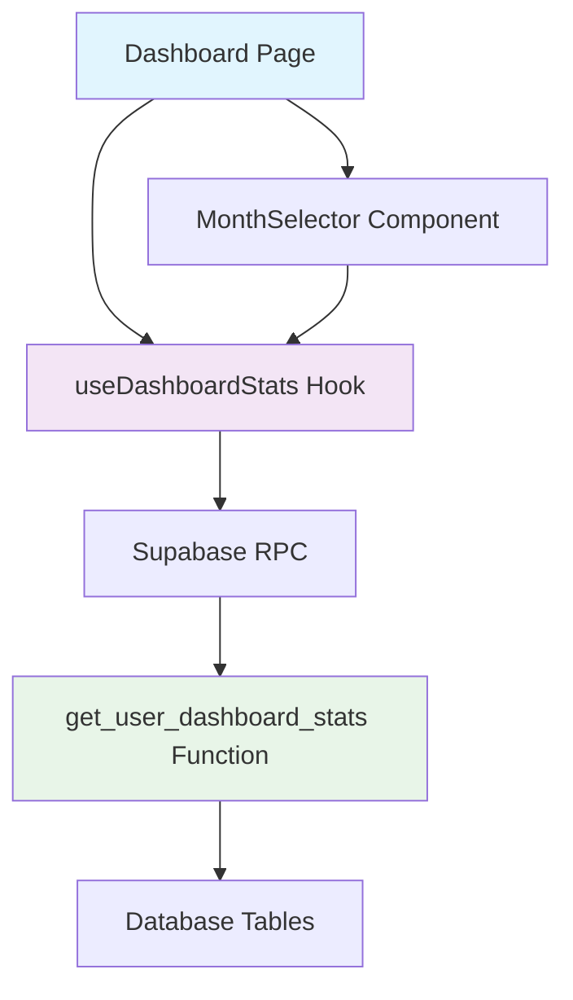

# 📊 Dashboard por Mês - Documentação Completa

## 📋 **Visão Geral**

O **Dashboard por Mês** é uma funcionalidade que permite aos usuários visualizar suas estatísticas de vendas filtradas por período mensal específico, oferecendo maior controle e análise histórica dos dados.

### ✨ **Funcionalidades Principais**

- 📅 **Seletor de Mês**: Interface intuitiva para escolher o período de análise
- 📊 **Filtro Inteligente**: Dados filtrados automaticamente pelo mês selecionado
- 🔄 **Mês Atual Padrão**: Sempre inicia mostrando dados do mês corrente
- 📈 **Indicadores Visuais**: Mostra quais meses têm dados disponíveis
- 🎯 **Performance Otimizada**: Cache inteligente por período selecionado

---

## 🚀 **Como Usar**

### **Interface do Usuário**

1. **Acesse o Dashboard**
   - Faça login no sistema
   - Será direcionado automaticamente para o dashboard

2. **Seletor de Mês**
   - Localizado logo abaixo do título "Dashboard de Vendas 📊"
   - Card azul com ícone de calendário
   - Dropdown para seleção do mês desejado

3. **Opções Disponíveis**
   - **"Mês Atual"**: Dados do mês corrente (padrão)
   - **Meses Anteriores**: Últimos 12 meses disponíveis
   - **Indicador "Com dados"**: Badge verde nos meses que têm vendas

4. **Dados Exibidos**
   - **Total de Vendas**: Soma de todas as vendas do período
   - **Total de Comissões**: 5% do total de vendas
   - **Itens Vendidos**: Quantidade total de produtos vendidos
   - **Última Atualização**: Data da última atualização do estoque

### **Exemplos de Uso**

```typescript
// Usuário seleciona "Julho 2024"
// Dashboard mostra apenas dados de 01/07/2024 a 31/07/2024

// Usuário clica em "Voltar ao Atual"
// Dashboard volta para o mês corrente
```

---

## 🔧 **Implementação Técnica**

### **Arquitetura da Solução**



### **Componentes Principais**

#### **1. Hook `useDashboardStats`**
```typescript
// Localização: src/presentation/hooks/useDashboardStats.ts
export function useDashboardStats(selectedMonth?: SelectedMonth | null)

// Tipos
export type SelectedMonth = {
  startDate: string // YYYY-MM-DD
  endDate: string   // YYYY-MM-DD
  label: string     // Ex: "Julho 2024"
}
```

#### **2. Componente `MonthSelector`**
```typescript
// Localização: src/presentation/components/dashboard/MonthSelector.tsx
export function MonthSelector({ 
  selectedMonth, 
  onMonthChange 
}: MonthSelectorProps)
```

#### **3. Hook `useAvailableMonths`**
```typescript
// Localização: src/presentation/hooks/useAvailableMonths.ts
export function useAvailableMonths()
// Retorna lista de meses que têm dados de vendas
```

### **Função SQL Principal**

```sql
-- Localização: Migrations SQL
CREATE OR REPLACE FUNCTION get_user_dashboard_stats(
    p_user_id UUID DEFAULT NULL,
    p_start_date DATE DEFAULT NULL,
    p_end_date DATE DEFAULT NULL
)
RETURNS TABLE (
    "totalSales" NUMERIC,
    "totalCommissions" NUMERIC,
    "totalItemsSold" BIGINT,
    "lastStockUpdate" TIMESTAMP WITH TIME ZONE
)
```

**Comportamento:**
- Se `p_start_date` e `p_end_date` são NULL: usa mês atual
- Se fornecidos: filtra dados no período especificado
- Se `p_user_id` é NULL: usa mapeamento automático do Supabase auth

---

## 📂 **Estrutura de Arquivos**

```
src/
├── presentation/
│   ├── hooks/
│   │   ├── useDashboardStats.ts          # Hook principal
│   │   └── useAvailableMonths.ts         # Hook meses disponíveis
│   └── components/
│       └── dashboard/
│           └── MonthSelector.tsx         # Seletor de mês
├── migrations/
│   ├── 014_add_monthly_filter_dashboard.sql    # Primeira versão
│   ├── 018_clean_duplicate_functions.sql       # Limpeza de conflitos
│   └── 019_setup_supabase_auth_integration.sql # Versão final
└── docs/
    ├── dashboard-mensal-documentacao.md   # Esta documentação
    └── dashboard-monthly-evolution.md     # Plano para Opção 2
```

---

## 🔐 **Sistema de Autenticação Dupla**

### **Como Funciona**

O sistema implementa autenticação dupla para compatibilidade:

1. **Login no Sistema Customizado** (baseado em tabela `users`)
2. **Login Automático no Supabase** (para RPC functions)

### **Fluxo de Login**

```typescript
// 1. Validação no sistema customizado
const result = await fetch('/api/auth/login', { ... })

// 2. Se sucesso, criar usuário temporário no Supabase
const tempEmail = `user${user.id.substring(0, 8)}@system.local`
await supabase.auth.signUp({ email: tempEmail, ... })

// 3. Login no Supabase com usuário temporário
await supabase.auth.signInWithPassword({ ... })
```

### **Mapeamento de Usuários**

```sql
-- Função que mapeia auth.uid() para user_id customizado
CREATE OR REPLACE FUNCTION get_custom_user_id()
RETURNS UUID AS $$
BEGIN
    -- Obtém user_id dos metadados ou usa auth.uid()
    RETURN COALESCE(
        (auth.user() -> 'user_metadata' ->> 'user_id')::UUID,
        auth.uid()
    );
END;
$$;
```

---

## 📊 **Performance e Cache**

### **Estratégias de Cache**

```typescript
// Cache por período selecionado
queryKey: ['dashboard-stats', user?.id, selectedMonth?.startDate, selectedMonth?.endDate]

// Configurações de cache
staleTime: 5 * 60 * 1000,        // 5 minutos para dados atuais
refetchOnWindowFocus: true,       // Atualiza ao focar janela
retry: 1                          // Uma tentativa em caso de erro
```

### **Otimizações SQL**

- **Índices**: Criados em `user_id` e `created_at` na tabela `orders`
- **COALESCE**: Evita NULLs nos cálculos
- **DATE casting**: Comparações otimizadas por data
- **JOINs**: Apenas quando necessário para itens vendidos

---

## ✅ **Testes e Validação**

### **Cenários Testados**

1. ✅ **Mês Atual**: Dados do mês corrente
2. ✅ **Mês Anterior**: Dados históricos
3. ✅ **Mês sem Dados**: Retorna zeros sem erro
4. ✅ **Usuário sem Pedidos**: Funciona normalmente
5. ✅ **Autenticação**: Login duplo funcionando
6. ✅ **Cache**: Não refaz queries desnecessárias
7. ✅ **Mobile**: Interface responsiva

### **Como Testar**

```bash
# 1. Executar migrações SQL
# No Supabase SQL Editor:
\i src/migrations/018_clean_duplicate_functions.sql
\i src/migrations/019_setup_supabase_auth_integration.sql

# 2. Reiniciar servidor
npm run dev

# 3. Fazer login e testar dashboard
# - Verificar seletor de mês
# - Trocar entre períodos
# - Verificar dados consistentes
```

---

## 🚀 **Próximas Evoluções**

### **Opção 2: Snapshots Mensais** (Planejado)

Ver documentação detalhada em: `src/docs/dashboard-monthly-evolution.md`

**Benefícios futuros:**
- ⚡ Performance ainda melhor para dados antigos
- 📊 Comparação visual entre meses
- 📈 Relatórios de tendências
- 💾 Backup automático de estatísticas

---

## 🐛 **Troubleshooting**

### **Problemas Comuns**

#### **Dashboard não carrega dados**
```
Sintoma: Cards mostram R$ 0,00
Causa: Problema de autenticação ou SQL
Solução: Verificar logs do console, reexecutar migrações
```

#### **Seletor de mês não aparece**
```
Sintoma: Componente não renderiza
Causa: Erro de import ou dependência
Solução: Verificar imports e reinstalar node_modules
```

#### **Erro RPC**
```
Sintoma: "Auth session missing"
Causa: Login duplo não funcionou
Solução: Fazer logout/login completo
```

### **Logs Úteis**

```typescript
// Console do navegador
🔐 Login customizado bem-sucedido, fazendo login no Supabase...
✅ Login no Supabase bem-sucedido
Dashboard Stats - resolved user_id: xxx, start_date: xxx, end_date: xxx
```

---

## 👥 **Contribuição**

### **Para Desenvolvedores**

1. **Antes de modificar**: Ler esta documentação completa
2. **Testes**: Sempre testar cenários com e sem dados
3. **SQL**: Validar performance em base com muitos registros
4. **Mobile**: Verificar responsividade
5. **Cache**: Considerar invalidação quando necessário

### **Convenções de Código**

```typescript
// Nomes de arquivos
useDashboardStats.ts    # Hooks começam com 'use'
MonthSelector.tsx       # Componentes em PascalCase
get_user_dashboard_stats.sql  # SQL em snake_case

// Tipos TypeScript
export type SelectedMonth = { ... }  # Types exportados
interface MonthSelectorProps { ... } # Interfaces para props
```

---

## 📞 **Suporte**

Para dúvidas ou problemas:
1. Consultar esta documentação
2. Verificar logs do console
3. Revisar migrações SQL executadas
4. Testar em ambiente limpo

**Funcionalidade implementada em:** Julho 2024  
**Versão:** 1.0.0  
**Status:** ✅ Funcional e testado