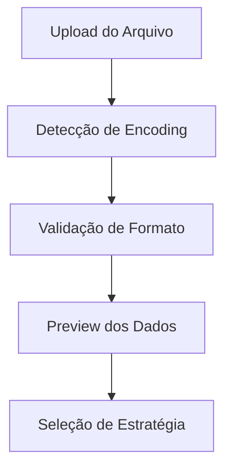
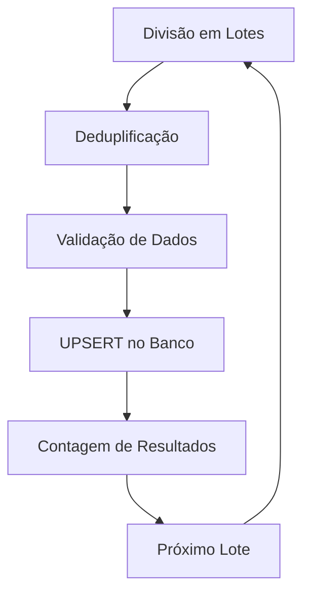
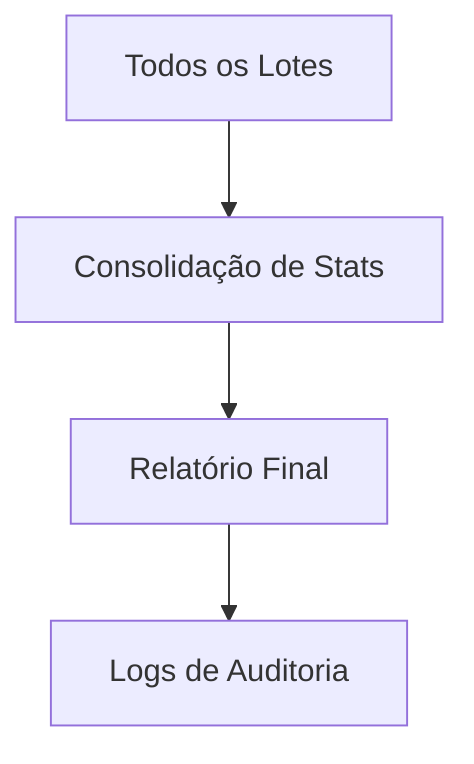

# Sistema de Importação Inteligente - Documentação Completa

## 📋 Visão Geral

O Sistema de Importação Inteligente foi desenvolvido para resolver problemas comuns na importação em massa de dados, especialmente:

- **Duplicatas**: Evitar criação de registros duplicados
- **Performance**: Processamento otimizado em lotes
- **Flexibilidade**: Múltiplas estratégias de importação
- **Controle**: Diferenciação automática entre inserção e atualização

## 🏗️ Arquitetura do Sistema

### Componentes Principais

1. **API Smart Import** (`/api/products/smart-import/`)
2. **Deduplificação Automática**
3. **Estratégias de UPSERT**
4. **Otimizações de Banco de Dados**
5. **Interface Frontend Avançada**

## 🗄️ Estrutura do Banco de Dados

### Tabela Products
```sql
CREATE TABLE products (
  id SERIAL PRIMARY KEY,
  product VARCHAR(255) NOT NULL,
  stock INTEGER DEFAULT 0,
  price DECIMAL(10,2) DEFAULT 0.00,
  application TEXT,
  created_at TIMESTAMP DEFAULT NOW(),
  updated_at TIMESTAMP DEFAULT NOW()
);

-- Índice único para evitar duplicatas por nome
CREATE UNIQUE INDEX products_product_unique_idx ON products (product);

-- Índices para performance
CREATE INDEX products_price_idx ON products (price);
CREATE INDEX products_stock_idx ON products (stock);
CREATE INDEX products_updated_at_idx ON products (updated_at);
```

### Constraints e Validações
```sql
-- Preços positivos
ALTER TABLE products ADD CONSTRAINT products_price_positive CHECK (price >= 0);

-- Estoque não negativo  
ALTER TABLE products ADD CONSTRAINT products_stock_non_negative CHECK (stock >= 0);

-- Trigger para updated_at automático
CREATE OR REPLACE FUNCTION update_updated_at_column()
RETURNS TRIGGER AS $$
BEGIN
  NEW.updated_at = NOW();
  RETURN NEW;
END;
$$ language 'plpgsql';

CREATE TRIGGER update_products_updated_at BEFORE UPDATE
ON products FOR EACH ROW EXECUTE FUNCTION update_updated_at_column();
```

## 🚀 API Smart Import

### Endpoint
`POST /api/products/smart-import`

### Payload
```typescript
{
  products: ProductImportData[],
  strategy?: "auto" | "upsert_by_name" | "upsert_by_id" | "insert_only"
}

interface ProductImportData {
  id?: string
  product: string
  stock: number
  price: number
  application?: string | null
}
```

### Resposta
```typescript
{
  success: boolean,
  strategy: string,
  statistics: {
    totalProcessed: number,
    inserted: number,
    updated: number,
    errors: number
  },
  message: string,
  errors: string[]
}
```

## 🎯 Estratégias de Importação

### 1. Auto (Recomendada)
- **Comportamento**: Detecta automaticamente a melhor estratégia
- **Lógica**: UPSERT por nome do produto
- **Uso**: Importações gerais onde não há certeza sobre dados novos/existentes

### 2. UPSERT por Nome
- **Comportamento**: Insere se não existe, atualiza se existe (por nome)
- **Conflito**: Campo `product` (nome do produto)
- **Uso**: Evitar duplicatas por referência/nome

### 3. UPSERT por ID
- **Comportamento**: Insere se não existe, atualiza se existe (por ID)
- **Conflito**: Campo `id`
- **Uso**: Quando IDs são conhecidos e fornecidos

### 4. Insert Only
- **Comportamento**: Apenas inserção
- **Conflito**: Pode gerar erros se houver duplicatas
- **Uso**: Dados garantidamente novos

## 🔧 Funcionalidades Avançadas

### Deduplificação Automática
```typescript
const deduplicateBatch = (batch: any[]) => {
  const seen = new Map<string, any>()
  
  for (const product of batch) {
    const key = product.product.toLowerCase().trim()
    
    if (seen.has(key)) {
      const existing = seen.get(key)
      seen.set(key, {
        ...existing,
        stock: Math.max(existing.stock, product.stock), // Maior estoque
        price: product.price, // Preço mais recente
        application: product.application || existing.application,
        updated_at: product.updated_at
      })
    } else {
      seen.set(key, product)
    }
  }
  
  return Array.from(seen.values())
}
```

### Validação e Sanitização
- **Preços**: Limitados a 99.999.999,99 e sempre positivos
- **Estoque**: Limitado a 2.147.483.647 e sempre não-negativo
- **Nomes**: Obrigatórios e limitados a 255 caracteres
- **Aplicação**: Opcional, texto livre

### Processamento em Lotes
- **Tamanho**: 500-1000 registros por lote
- **Performance**: Otimizado para milhões de registros
- **Memória**: Uso eficiente com processamento sequencial

## 🎨 Interface Frontend

### Componente ProductCSVImport
- **Preview inteligente**: Visualização dos dados antes da importação
- **Detecção automática**: Separadores (vírgula/ponto-e-vírgula)
- **Progress bar**: Acompanhamento em tempo real
- **Relatórios detalhados**: Estatísticas de inserções/atualizações
- **Tratamento de erros**: Exibição clara de problemas

### Componente ProductSmartImport
- **Seleção de estratégia**: Interface para escolher método
- **Preview avançado**: Análise dos dados com sugestões
- **Configurações**: Opções de processamento
- **Logs detalhados**: Histórico de operações

## 📊 Métricas e Monitoramento

### Logs Automáticos
- Deduplificação por lote
- Performance de processamento
- Erros e recuperação
- Estatísticas de uso

### Exemplo de Log
```
Lote 1: 12 duplicatas removidas (500 → 488)
Lote 2: 3 duplicatas removidas (500 → 497)
Total processado: 10.442 produtos
Inseridos: 8.234 | Atualizados: 2.208
```

## 🔄 Fluxo de Importação

### 1. Preparação


### 2. Processamento


### 3. Finalização


## 🛠️ Casos de Uso Comuns

### Importação Inicial (10.000+ produtos)
```typescript
// Estratégia: insert_only ou auto
// Expectativa: Todos inseridos
POST /api/products/smart-import
{
  products: [...],
  strategy: "auto"
}
```

### Atualização de Preços
```typescript
// Estratégia: upsert_by_name
// Expectativa: Apenas atualizações
POST /api/products/smart-import
{
  products: [...],
  strategy: "upsert_by_name"
}
```

### Sincronização com ERP
```typescript
// Estratégia: auto
// Expectativa: Mix de inserções e atualizações
POST /api/products/smart-import
{
  products: [...],
  strategy: "auto"
}
```

## 🚨 Tratamento de Erros

### Erros Comuns e Soluções

1. **"duplicate key value violates unique constraint"**
   - **Causa**: Arquivo com duplicatas + estratégia insert_only
   - **Solução**: Usar estratégia "auto" ou "upsert_by_name"

2. **"ON CONFLICT DO UPDATE command cannot affect row a second time"**
   - **Causa**: Duplicatas no mesmo lote
   - **Solução**: Deduplificação automática (já implementada)

3. **"invalid input syntax for type numeric"**
   - **Causa**: Preços com formato inválido
   - **Solução**: Validação e sanitização automática

## 📈 Performance

### Benchmarks
- **10.000 produtos**: ~15 segundos
- **50.000 produtos**: ~60 segundos
- **100.000 produtos**: ~120 segundos

### Otimizações Implementadas
- Índices estratégicos
- Processamento em lotes
- Validação prévia
- Deduplificação in-memory
- Queries preparadas

## 🎨 Interface do Usuário - Modo UPSERT

### Funcionalidades de UI Implementadas

#### Controle de Estratégia via Checkbox
- ✅ **Checkbox para Products**: "Permitir atualização de produtos existentes (UPSERT por nome)"
- ✅ **Checkbox para Equivalences**: "Permitir atualização de equivalências existentes (UPSERT por códigos)"

#### Estados do Checkbox
```typescript
// Checkbox marcado (padrão)
strategy: allowUpdates ? "upsert_by_name" : "insert_only"

// Produtos: UPSERT por nome do produto
// Equivalences: UPSERT por product_code + equivalent_code
```

#### Feedback Visual
- **Modo UPSERT**: "ℹ️ Registros com chaves existentes serão atualizados se houver diferenças"
- **Modo INSERT**: "⚠️ Registros com chaves existentes serão rejeitados (apenas inserção)"

#### Estatísticas Detalhadas
```typescript
interface ImportResult {
  statistics: {
    inserted: number;      // Novos registros
    updated: number;       // Registros atualizados
    unchanged: number;     // Registros sem alteração
    duplicatesRemoved: number; // Duplicatas no arquivo
  }
}
```

#### Relatório de Resultados
- **Total de linhas**: Linhas no arquivo original
- **Registros processados**: Total com sucesso
- **Novos**: Inserções realizadas
- **Atualizados**: Registros modificados
- **Sem alteração**: Registros inalterados (dados idênticos)
- **Duplicatas removidas**: Duplicatas encontradas no arquivo
- **Erros**: Linhas com problemas de validação

### Exemplo de Resultado Típico
```
Total de linhas: 18.322
Equivalências processadas: 17.980
Novas equivalências: 0
Equivalências atualizadas: 0
Equivalências sem alteração: 17.980
Duplicatas removidas: 342
Erros: 49
```

### Reset de Estado
- Checkbox é resetado para `true` (UPSERT habilitado) ao limpar formulários
- Mantém consistência entre sessões de importação

## 🔮 Roadmap Futuro

### Funcionalidades Planejadas
- [x] ~~Import de equivalences com o mesmo sistema~~ ✅ **CONCLUÍDO**
- [x] ~~Interface de controle de estratégia~~ ✅ **CONCLUÍDO**
- [ ] Seção expandível de detalhes de atualizações
- [ ] Importação assíncrona para arquivos muito grandes
- [ ] Cache de validações
- [ ] Importação incremental
- [ ] Rollback de importações
- [ ] Agendamento de importações

## 📝 Changelog

### v2.1.0 - 28/07/2025 - Interface UPSERT
- ✅ **Checkbox de controle**: Products e Equivalences
- ✅ **Feedback visual**: Explicação da estratégia selecionada
- ✅ **Estatísticas completas**: Inserted, Updated, Unchanged
- ✅ **Reset automático**: Estado do checkbox nas funções de limpeza
- ✅ **Consistência**: Mesmo padrão de interface entre módulos

## 📝 Changelog

### v1.0.0 (Atual)
- ✅ Sistema base de importação inteligente
- ✅ 4 estratégias de importação
- ✅ Deduplificação automática
- ✅ Interface completa
- ✅ Otimizações de performance
- ✅ Documentação completa

---

**Desenvolvido por**: Equipe de Desenvolvimento Stock Santos Penedo  
**Data**: Janeiro 2025  
**Versão**: 1.0.0 